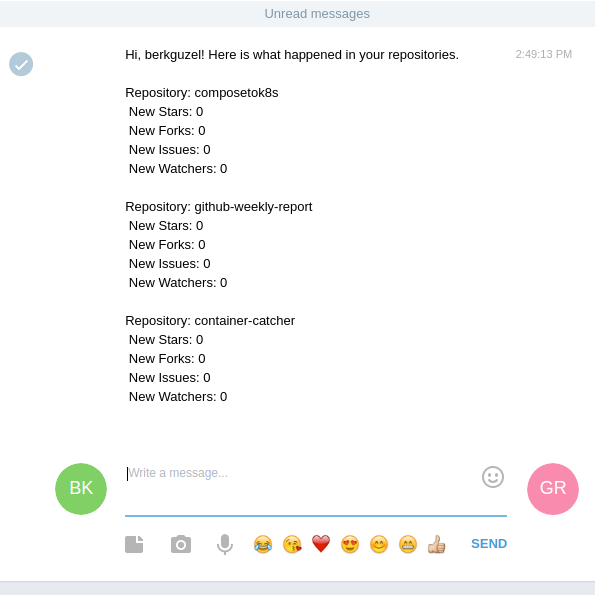

# github-weekly-report

#### `github-weekly-report` watches your repositories, specified by you, and notifies you on Telegram about what occurred on your repositories.


# USAGE

**ACCESS_TOKEN** = Github Access Token.

**OWNER** = Owner of the Github account.

**REPOSITORY** = Name of your repositories you want to get notification. 
- You can pass  ```all```
    - REPOSITORY="all" 
- You can pass many repositories by seperating them using comma
    - REPOSITORY="repository1, repository2"


**CHATID** = Telegram provides CHATID in response of this url  `https://api.telegram.org/bot<TOKEN>/getUpdates?offset=0` 

**TOKEN** = Telegram provides TOKEN when you created a Bot.

## You can run also without Docker but firstly you should pass the variables.
```
export ACCESS_TOKEN="" \
> OWNER="" \
> REPOSITORY="" \
> CHATID="" \
> TOKEN="" \

```

## Docker 

```
 docker build -t github-weekly-report .
```

```
docker run -d \
> -e ACCESS_TOKEN="" \
> -e OWNER="" \
> -e REPOSITORY="" \
> -e CHATID="" \
> -e TOKEN="" \
> github-weekly-report


```
#### ```--interval``` option is also available. You may change your time interval to get notification. 

You can get your notifications as daily, hourly or in minutes.
Default value is weekly.
```
...
...
> github-weekly-report --interval="1h" -> notify you once in a hour. 

```

# DEMO




