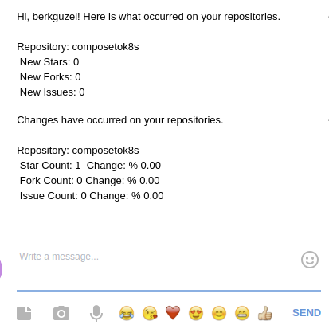

# github-weekly-report

### `github-weekly-report` watches your repositories, specified by you, and notify about what happened in your repositories.


# USAGE

### You can run with your compiler but firstly you must pass variables

```
export ACCESS_TOKEN="" \
> OWNER="" \
> REPOSITORY="" \
> CHATID="" \
> TOKEN="" \

```

### Docker 

```
 docker build -t github-weekly-report .
```

```
docker run -d \
> -e ACCESS_TOKEN="" \
> -e OWNER="" \
> -e REPOSITORY="" \
> -e CHATID="" \
> -e TOKEN="" \
> github-weekly-report


```

# DEMO




